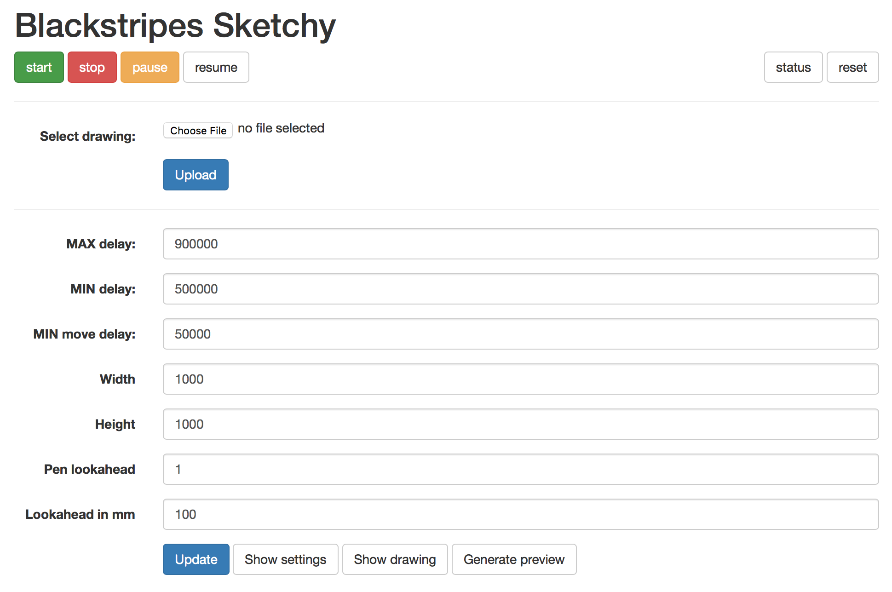

blackstripes-drawbot-driver
===========================

This is the driver we use at [blackstripes.nl](http://www.blackstripes.nl). It controls two stepper motors and a single solenoid for pen lifting. The main features are:

1. Direct SVG workflow. Upload svg to the Raspberry-PI through web based interface, no translation to g-code needed.
2. Speed management through web interface.
3. Automatic lookahead acceleration management.
4. Simple Lua scripting interface. `moveTo(x,y) penUp() penDown()`
5. Can control V-plotters as well as other machines.
6. Standalone operation with a single Raspberry-PI

<iframe width="1020" height="574" src="https://www.youtube.com/embed/Wb5XR8IF5E0" frameborder="0" allowfullscreen></iframe>

Dependencies
============

This will run on a Raspberry-PI model B+. 
[Xenomai](http://www.http://xenomai.org) must be Installed.

This project uses the following excellent opensource software:

###LodePNG:
[https://github.com/lvandeve/lodepng](https://github.com/lvandeve/lodepng)

###Nano SVG:
[https://github.com/memononen/nanosvg](https://github.com/memononen/nanosvg)

###lua-5.2.3:
[https://github.com/lua/lua](https://github.com/lua/lua)

###inih:
[https://github.com/benhoyt/inih](https://github.com/benhoyt/inih)

How to compile
==============

###On the Raspberry-PI (Xenomai enabled model B+)

1. clone this repo
2. build the server
	1. cd to sketchy_server
	2. `make`
	3. `make install`
3. build the driver
	1. cd to sketchy_driver
	2. `make pi`
	3. `make install`
4. build the (optional) preview-driver
	1. cd to sketchy_driver
	2. `make preview`
	3. `make installp`
	
Now cd into the build directory and start the server.

`sudo nohup ./sketchy-server`

Now find out the IP-address of your Raspberry-PI and point your webbrowser to port 8000.
`(http://192.168.x.xxx:8000)` You should see this page:

## GPIO pins Raspberry-PI (model B+)

These are the pins to be connected to the setpper drivers and the relay to control the solenoid.

	#define RIGHT_CLOCK RPI_V2_GPIO_P1_11
	#define RIGHT_DIR RPI_V2_GPIO_P1_12
	#define LEFT_CLOCK RPI_V2_GPIO_P1_13
	#define LEFT_DIR RPI_V2_GPIO_P1_15
	#define SOLENOID RPI_V2_GPIO_P1_16

	

## Cross compilation

For crosscompiling we have created a crosscompile target in the make files.
Our cross-compiling machine has these cross compiling tools installed:

####Toolchain
git clone https://github.com/raspberrypi/tools

You can then copy the toolchain to a common location such as 
/tools/arm-bcm2708/gcc-linaro-arm-linux-gnueabihf-raspbian, and add 
/tools/arm-bcm2708/gcc-linaro-arm-linux-gnueabihf-raspbian/bin to 
your $PATH in the .bashrc in your home directory. 
For 64bit, use /tools/arm-bcm2708/gcc-linaro-arm-linux-gnueabihf-raspbian-x64/bin. 
While this step is not strictly necessary, it does make it easier for later command lines!

To find out the lib path of this cross-coompiler you need to do this

$ arm-linux-gnueabihf-gcc -print-sysroot

this will show where to look for libc.

also:

$ arm-linux-gnueabihf-gcc -print-search-dirs
 
You need to have rpi compiled libs of xenomai and native. I got them from a xenomaied Raspberry pi from /usr/lib/

Then you need to copy these libnative.* and libxenomai.* files into this sysroot in the folder 
[sysroot compiler]/usr/lib/ 

That together with some modified targets for using the right compiler include path and you are ready to roll.

